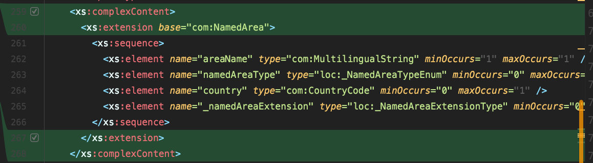

# DATEXII Java library

>**Disclaimer**: This documentation is work in progress. There hasn't been any documentation written initially so this
> guide is merely an assumption on how the process should work.

## Adding new XML Schemas Definitions (XSD)
>**Note:** The Maven packages used for this are outdated. We have put in effort to update this, but for some reason the
> code kept generating imports with `javax.*` instead of `jakarta.*`. This hasn't been fixed so far, so the mitigation
> for this problem was to use the `maven-replaced-plugin`, but that dependency itself was also last updated in 2012 so
> that also didn't seem like that good of an idea.

1. Start by creating a new Git branch based on the latest `main` branch.

2. Checkout the newly created branch.

### Generate Java Code
1. Add the new XSD files to the `src/main/resources/xsd` directory.

2. Set the data feed name and the version in the `pom.xml` artifact version (i.e. `IVRA-1.1-SNAPSHOT`). Do not forget
   the `-SNAPSHOT` suffix if you plan to push your work in multiple times to Azure DevOps.

3. There is a plugin configuration commented in the `pom.xml` named `cxf-codegen-plugin`. Uncomment this plugin.
   This plugin has been commented deliberately, since we need to do some manual rework after the code has been
   generated. By commenting the plugin, the CI pipeline is unable to overwrite the generated code, including our manual
   rework. Also, make sure the `-npa` XJC argument is commented and thus not active. Enabling the `-npa` XJC argument
   will prevent the plugin from generating `package-info` files, which are required at a later stage.

4. In the `cxf-codegen-plugin` configuration, add package names for each XSD using `<packageName>` elements. This will
   specify the target package to generate code to. For example:
```xml
<packagenames>
   <packagename>
      http://datex2.eu/schema/3/messageContainer=eu.datex.messagecontainer
   </packagename>
</packagenames>
```

6. Generate the code by running `mvn clean compile`. There should be new additions in the sources (`src/main/java`)
   folder.

7. Comment the `cxf-codegen-plugin` plugin configuration in the `pom.xml`.

### Prefix XML namespaces
If the above steps are performed correctly, each generated Java package should contain a `package-info` class. We need
to modify these so that the same prefix is being used every time the data is serialized to XML. If not, Spring might
arbitrarily pick a namespace prefix, which is not convenient for testing purposes.

Update the `package-info` file to look like this:
```java
@XmlSchema(namespace = "http://datex2.eu/schema/3/messageContainer",
        elementFormDefault = XmlNsForm.QUALIFIED,
        xmlns = @XmlNs(prefix = "mes", namespaceURI = "http://datex2.eu/schema/3/messageContainer")) // Add this to the generated code
package eu.datex.messagecontainer;

import javax.xml.bind.annotation.XmlNs;
import javax.xml.bind.annotation.XmlNsForm;
import javax.xml.bind.annotation.XmlSchema;
```

1. Set the XML namespace prefix as you wish and set the namespaceURI to the same URL that is referenced in the
   `namespace` argument of @XmlSchema.

2. In the above example, the fully qualified names that were generated have been replaced with
   an import statement. This is optional, but keeps things somewhat more concise.

3. Repeat steps 1 and 2 for each package.

4. The `d2Payload` package does not have `package-info` file. Add a `package-info` file with the following
   configuration:
```java
@XmlSchema(namespace = "http://datex2.eu/schema/3/d2Payload",
        elementFormDefault = XmlNsForm.QUALIFIED,
        xmlns = @XmlNs(prefix = "d2", namespaceURI = "http://datex2.eu/schema/3/d2Payload"))
package eu.datex.d2payload;
```

6. In the `pom.xml`, uncomment the `-npa` argument of the `cxf-codegen-plugin`. This will prevent the plugin
   from overwriting the `package-info` files with the custom namespace prefix.

### Setting an XML root element
For serializing an object to XML, it's required to annotate a certain class as an @XmlRootElement. Which class this
is differs per project. For example, we write a subclass of PayloadPublication for the traffic jam detection datafeed:

```java
@XmlRootElement // Add this annotation
// ... other annotations 
public abstract class PayloadPublication {
   // Field and method declarations
}
```

### Verify integration with other applications
Now it's time to verify whether the applications work. Import the snapshot version of this dependency into your project
and run the integration tests. Most likely these will fail since the current XML data does not match the new XML.

### Releasing the package
1. Remove the `-SNAPSHOT` suffix from the Maven artifact version

## Notes
while parsing the file [src/main/resources/xsd/DATEXII_3_LocationReferencing.xsd](src/main/resources/xsd/DATEXII_3_LocationReferencing.xsd) there were some errors due to the following object.
Instead of fixing the root cause the decision was made to remove this(highlighted in green in the image below) part as the current implementations do not need it. 
This might however become an issue in the future...


